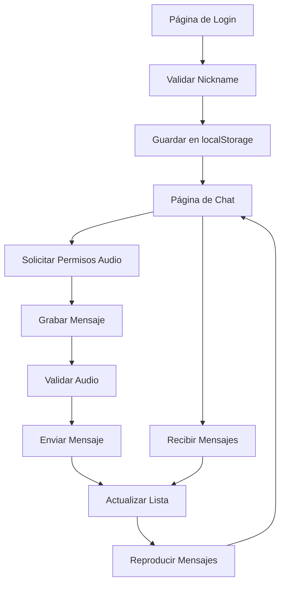

# ChatVoz - Aplicación de Chat de Voz

## 1. Descripción General del Producto
ChatVoz es una aplicación web de chat en tiempo real que permite a los usuarios comunicarse exclusivamente a través de mensajes de voz. La aplicación está construida con Vue 3, utiliza Composition API y Pinia para el manejo de estado, proporcionando una experiencia de usuario fluida y moderna para la comunicación por audio.

La aplicación resuelve la necesidad de comunicación rápida y personal a través de mensajes de voz, dirigida a usuarios que prefieren la comunicación oral sobre la escrita. El producto ofrece una alternativa moderna a los chats de texto tradicionales.

## 2. Funcionalidades Principales

### 2.1 Roles de Usuario
| Rol | Método de Registro | Permisos Principales |
|-----|-------------------|---------------------|
| Usuario | Ingreso con nickname (localStorage) | Puede enviar y recibir mensajes de voz, reproducir audio |

### 2.2 Módulo de Funcionalidades
Nuestra aplicación ChatVoz consta de las siguientes páginas principales:
1. **Página de Login**: formulario de nickname, validación de entrada, almacenamiento local.
2. **Página de Chat**: lista de mensajes, grabación de audio, reproducción de mensajes.
3. **Configuración de Audio**: permisos de micrófono, configuración de calidad de audio.

### 2.3 Detalles de Páginas

| Nombre de Página | Nombre del Módulo | Descripción de Funcionalidad |
|------------------|-------------------|------------------------------|
| Página de Login | Formulario de Nickname | Validar entrada de nickname (mínimo 3 caracteres), guardar en localStorage, redireccionar al chat |
| Página de Login | Validación de Estado | Verificar si existe nickname guardado, auto-login si está disponible |
| Página de Chat | Header del Chat | Mostrar nickname actual, botón de logout, indicador de estado de conexión |
| Página de Chat | Lista de Mensajes | Renderizar mensajes de voz en orden cronológico, mostrar autor y timestamp |
| Página de Chat | Grabación de Audio | Solicitar permisos de micrófono, grabar hasta 30 segundos, validar audio no vacío usando AudioContext |
| Página de Chat | Controles de Grabación | Botón iniciar/detener grabación, indicador visual de tiempo, cancelar grabación |
| Página de Chat | Envío de Mensajes | Procesar audio grabado, simular envío con BroadcastChannel, agregar a lista local |
| Página de Chat | Reproducción de Audio | Controles play/pause, velocidad de reproducción (1x, 1.5x, 2x), mostrar duración total |
| Página de Chat | Recepción en Tiempo Real | Escuchar mensajes entrantes via BroadcastChannel, actualizar lista automáticamente |
| Configuración de Audio | Permisos de Micrófono | Gestionar permisos de audio, mostrar estado de acceso al micrófono |
| Configuración de Audio | Calidad de Audio | Configurar bitrate y formato de grabación, preview de configuración |

## 3. Proceso Principal

**Flujo Principal del Usuario:**
1. El usuario ingresa su nickname en la página de login
2. El sistema valida y guarda el nickname en localStorage
3. El usuario accede al chat principal donde puede ver mensajes existentes
4. Para enviar un mensaje: solicita permisos de micrófono, graba audio (máximo 30s), valida que no esté en silencio, y envía el mensaje
5. Los mensajes se reciben en tiempo real y se muestran en la lista
6. El usuario puede reproducir cualquier mensaje con controles de velocidad

## 4. Diseño de Interfaz de Usuario

### 4.1 Estilo de Diseño
- **Colores primarios**: #2563eb (azul principal), #1e40af (azul secundario)
- **Colores de acento**: #10b981 (verde para grabación), #ef4444 (rojo para detener)
- **Estilo de botones**: Redondeados con sombras suaves, efectos hover
- **Tipografía**: Inter o system fonts, tamaños 14px-18px para texto principal
- **Estilo de layout**: Diseño de tarjetas para mensajes, navegación superior fija
- **Iconos**: Lucide icons o Heroicons para consistencia visual

### 4.2 Resumen de Diseño de Páginas

| Nombre de Página | Nombre del Módulo | Elementos de UI |
|------------------|-------------------|----------------|
| Página de Login | Formulario de Nickname | Input centrado con placeholder, botón primario azul, validación en tiempo real con bordes rojos/verdes |
| Página de Chat | Header del Chat | Barra superior fija con nickname, botón logout, indicador de conexión (punto verde/rojo) |
| Página de Chat | Lista de Mensajes | Tarjetas de mensajes con avatar circular, timestamp, controles de reproducción integrados |
| Página de Chat | Grabación de Audio | Botón circular grande para grabar (rojo cuando activo), indicador de tiempo, animación de ondas sonoras |
| Página de Chat | Reproducción de Audio | Barra de progreso, botones play/pause, selector de velocidad, duración mostrada |
| Configuración de Audio | Permisos | Modal o sidebar con estado de permisos, botón para solicitar acceso |

### 4.3 Responsividad
La aplicación es mobile-first con adaptación para desktop. Optimizada para interacción táctil en dispositivos móviles, con botones de tamaño adecuado para dedos y gestos intuitivos para grabación de audio.